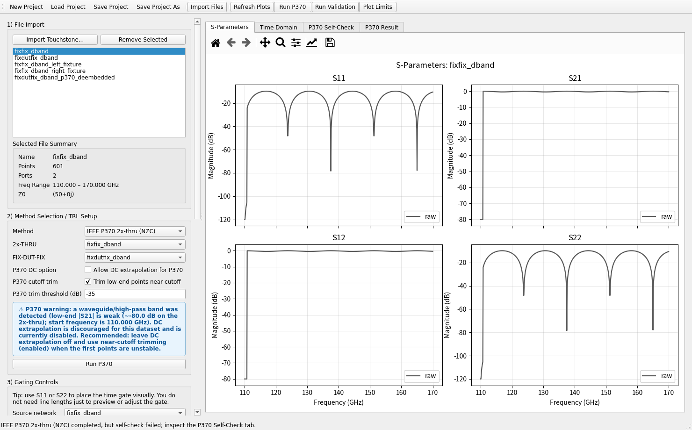

# RF De-Embedding Lab

A Python desktop tool for importing Touchstone files, inspecting S-parameters, doing time-domain gating, running several fixture-removal / TRL workflows, and plotting validation diagnostics.

This project is aimed at practical RF and high-speed interconnect measurement work, especially when you want a lightweight local tool that can:

- load `.s1p` / `.s2p` data
- compare raw and processed networks
- preview time-domain responses and apply gates
- estimate line propagation from TRL-like standards
- run IEEE P370 2x-thru de-embedding
- inspect residuals, validation plots, and fixture quality indicators

## Quick start (60 seconds)

```bash
python -m venv .venv
# Windows: .venv\Scripts\activate
# Linux/macOS: source .venv/bin/activate
python -m pip install --upgrade pip
python -m pip install -r requirements.txt
python ui_app.py
```

If you just want to confirm the repository is healthy before sharing it, run:

```bash
python smoke_ui.py
python smoke_p370_ui.py
python test_known_fixture_decascade.py
```

## Screenshot

Main window with the scrollable control pane, P370 warning banner, plotting tabs, and validation area:



## Main features

- PySide6 GUI for Touchstone import, plotting, and workflow control
- Time-domain gating with:
  - bandpass impulse
  - lowpass impulse
  - lowpass step
- De-embedding / extraction workflows:
  - Single-line TRL
  - Multiline TRL
  - Short/Long Differential extraction
  - Known Fixture De-cascade
  - IEEE P370 2x-thru (NZC)
- Validation and visualization:
  - S-parameter overlays
  - time-domain plots
  - TRL diagnostics
  - IEEE P370 self-check residual plots
- Direct result export:
  - export the latest de-embedded 2-port result directly as `.s2p` from the GUI
- D-band / high-pass safety improvements for P370:
  - near-cutoff trimming
  - NaN/Inf checks with clearer error messages
  - optional DC extrapolation
  - GUI warning banner for waveguide / high-pass datasets
- Responsive GUI improvements:
  - scrollable left control panel
  - wrapped form rows for smaller screens
  - improved layout behavior on smaller monitors

## Project layout

- `ui_app.py` — main desktop GUI
- `rfdeembed/` — core library code
  - `sparameter_data.py` — Touchstone IO and network helpers
  - `time_gating.py` — time-domain transforms and gates
  - `trl_deembedder.py` — TRL and fixture de-cascade backend
  - `p370_2xthru.py` — IEEE P370 2x-thru backend
  - `plot_generator.py` — plotting helpers
  - `validation_checks.py` — validation report helpers
- `demo_backend.py` — small synthetic backend demo
- `smoke_*.py`, `test_*.py` — smoke tests and regressions

## Installation

### 1) Create a virtual environment

Windows:

```bash
python -m venv .venv
.venv\Scripts\activate
```

Linux / macOS:

```bash
python3 -m venv .venv
source .venv/bin/activate
```

### 2) Install dependencies

```bash
python -m pip install --upgrade pip
python -m pip install -r requirements.txt
```

## Run the GUI

```bash
python ui_app.py
```

## Quick usage

1. Import Touchstone files.
2. Choose a method in the **Method Selection / TRL Setup** panel.
3. Select the required standards or fixture files.
4. Click **Solve / De-embed** or **Run P370**.
5. If the result looks good, click **Export De-embedded S2P** to save the latest 2-port de-embedded result directly.
6. Review the plots in the tabs on the right.
7. Check the validation panel and warnings.

## What the methods are for

### 1) Single-line TRL
Use this when you have a THRU and one LINE standard with known physical length difference.

Best for:
- simple planar structures
- moderate bandwidth
- quick TRL-based extraction when only one good line is available

Pros:
- simplest TRL workflow
- easy to set up
- useful for extracting approximate fixture halves and de-embedding a DUT

Cons:
- less robust over very wide bandwidth
- accuracy can degrade where the line / thru phase relationship is unfavorable

### 2) Multiline TRL
Use this when you have a THRU and two or more LINE standards with different lengths.

Best for:
- wider bandwidth measurements
- cases where single-line TRL becomes noisy or unstable in parts of the band
- PCB / CPWG interconnect work when multiple standards are available

Pros:
- more robust than single-line TRL across frequency
- different lines help cover each other’s weak regions

Cons:
- requires more standards and measurements
- still depends on line quality and length planning

### 3) Short/Long Differential
Use this when your main goal is differential line characterization from a short and a long structure.

Best for:
- extracting propagation constant, loss, and delay trends
- differential structures
- helping analyze line behavior before a more complete calibration / de-embedding flow

Pros:
- straightforward when only short and long structures are available
- useful for propagation extraction

Cons:
- more of a line-extraction tool than a full general DUT de-embedding workflow

### 4) Known Fixture De-cascade
Use this when you already have trustworthy left and right fixture S-parameter files and want to remove them from a measured `FIX-DUT-FIX` network.

Best for:
- EM-simulated fixture halves
- previously extracted fixture models
- lab flows where fixture halves were characterized earlier and reused

GUI inputs:
- **Left fixture**: fixture on port 1 side
- **Right fixture**: fixture on port 2 side
- **Measured FIX-DUT-FIX**: the measured network that still contains both fixtures and the DUT

Pros:
- direct and transparent
- no need to estimate fixture halves from standards
- useful for reusing fixture models across many DUT measurements

Cons:
- depends entirely on fixture model accuracy
- all three networks must share the same frequency grid

### 5) IEEE P370 2x-thru (NZC)
Use this when you have:
- a `2x-thru` / `FIX-FIX` measurement
- a `FIX-DUT-FIX` measurement

Best for:
- practical fixture removal without a full TRL standards set
- interconnect / fixture characterization workflows
- standardized de-embedding with self-check diagnostics

Pros:
- practical and standards-oriented
- built-in self-check plots and residual metrics
- good fit for many fixture-based PCB / connector measurements

Cons:
- more sensitive to high-pass / waveguide-style bands
- low-end instability, synthetic DC assumptions, or near-cutoff behavior can cause failure if not handled carefully

## Notes for D-band / waveguide users

For high-pass or waveguide-like datasets:

- prefer **bandpass** time-domain viewing rather than lowpass transforms
- disable **DC extrapolation for P370** unless you have a very specific reason to use it
- enable **Trim low-end points near cutoff** when the first samples are weak or unstable
- watch the GUI warning banner; it appears when the selected P370 data looks waveguide / high-pass-like

Recommended starting point for D-band P370:
- DC extrapolation: **off**
- cutoff trim: **on**
- trim threshold: around `-35 dB` to `-45 dB`

## Running tests

You can run the included smoke tests / regressions directly:

```bash
python smoke_ui.py
python smoke_p370_ui.py
python test_ui_responsive.py
python test_p370_native.py
python test_p370_dband_patch.py
python test_p370_warning_banner.py
```

## Demo script

A small synthetic backend demo is included:

```bash
python demo_backend.py
```

This writes example plots and Touchstone files into `demo_outputs/`.

## Current limitations

- The project is designed around practical engineering workflows, not a full metrology-grade calibration package.
- IEEE P370 support in this project is currently focused on the implemented single-ended NZC workflow and the associated safeguards.
- Mixed-mode / full production packaging are not yet completed.

## Recommended extras before sharing publicly

This repo now includes a `.gitignore`, an MIT `LICENSE`, and the basic install/docs files. For smoother sharing, these are still strongly recommended additions:

- one or two screenshots or a short GIF in the README
- a small sample dataset that is safe to share
- GitHub release notes / tags
- optional `pyproject.toml` if you later want to package it more formally

A practical `.gitignore` should at least exclude:
- `__pycache__/`
- `.venv/`
- `*.pyc`
- large generated plots / output folders if you do not want them versioned

## Tested environment

This repository was validated in a local environment with:

- Python 3.13.12
- NumPy 2.3.5
- SciPy 1.17.0
- Matplotlib 3.10.8
- PySide6 6.11.0
- scikit-rf 1.11.0

If you use a different Python or package version, behavior may differ slightly.

## Disclaimer

This tool is intended for engineering productivity and internal analysis workflows. Always verify de-embedded results against known standards, physical expectations, and measurement sanity checks before using them in formal reports or design signoff.
